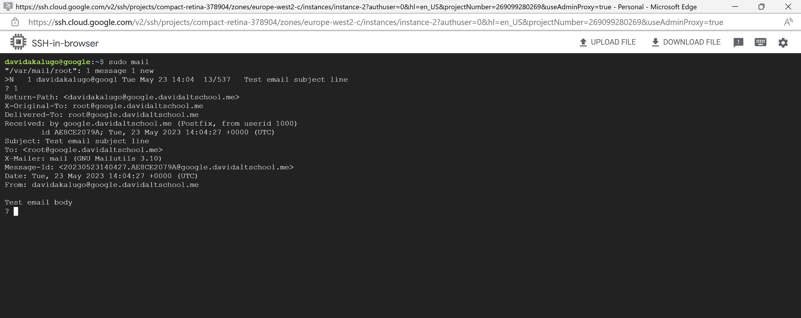

# 1. Setting Up a Mail and Web Server
(i) To set up a mail server, I installed the mailutils package and postfix on a GCP virtual machine with a LInux OS (Ubuntu Distribution):

```
sudo apt update
sudo apt install postfix mailutils -y
```
(ii) Next, the configuration file for postfix was edited and the _inet_interfaces_, _mydestination_, and _myhostname_ fields were modified.

(iii) The Postfix service was restartes:

```
sudo systemctl restart postfix
```

(iv) Mail was sent from the user __davidakalugo__ to the __root__ user.


# 2. Web Server

(i) An apache web server was set up using the following commands:

```
sudo apt update
sudo apt install apache2 -y
sudo systemctl start apache2
sudo systemctl enable apache2
```

(ii) Static files were hosted in the /var/www/html directory.
